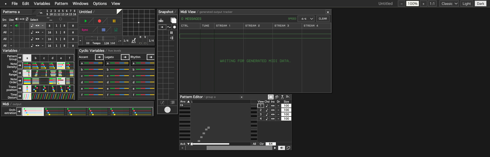

# idM

**An algorithmic composer inspired by M, the classic sequencer.**

You do not write notes in idM. You set up processes — patterns, cyclic
variables, note-order mixes, density and transposition tables — and then you
play *those*, live, while they generate. It is an instrument for composing by
steering rather than by typing.

idM generates **MIDI**. It runs as an **AU**, a **VST3**, a **CLAP**, a
**standalone app**, and in a **browser**.

[](LICENSE)
[](CHANGELOG.md)
[](#formats)
[](#platforms)
[](#how-it-is-tested)

> **Alpha, and looking for testers.** macOS is built, validated and confirmed
> working in Ableton Live 12. Windows and Linux are **not built yet** — see
> [Platforms](#platforms) for exactly what has and has not been run. If you try
> it, [open an issue](https://github.com/rjvaleo/idM/issues); host reports are
> the most useful thing anyone can send right now.




*Light and dark. Every Voice keeps its colour across every window.*

## Formats

| Format | Type | Built | Validated |
|---|---|---|---|
| **AU** | instrument (`aumu`, `idMa`) | yes | `auval` passes |
| **AU** | MIDI FX (`aumi`, `idMm`) — for Logic's MIDI FX slot | yes | `auval` passes |
| **VST3** | instrument with MIDI out | yes | loads and emits under JUCE's VST3 host |
| **CLAP** | instrument with MIDI out | yes | **not yet loaded in a CLAP host** |
| **Standalone** | app with its own MIDI port and clock | yes | emits notes and 24-PPQN clock, heard from another process |
| **Browser** | the same interface, Web MIDI out | yes | Chromium-based browsers |

The plugin is deliberately **not** built as a MIDI-effect VST3. One with no
audio buses is rejected by Ableton outright. The reasoning, with sources, is in
[`HOSTS.md`](HOSTS.md).

## Platforms

Nothing in this table is a guess.

| | Status |
|---|---|
| **macOS** (Apple Silicon + Intel) | **built and validated.** Universal binaries, minimum macOS 11. |
| **Ableton Live 12**, macOS | **confirmed working** — notes reach a synth on a second track. |
| Logic, Bitwig, Reaper, Cubase, Studio One, FL | **untested.** No reports yet. |
| **Windows** | **not built and not tested.** |
| **Linux** | **not built and not tested.** |

Windows and Linux are the next real piece of work. JUCE supports both, and the
engine is plain C++ with no platform code in it, so nothing is known to be in
the way — but nothing has been compiled, so nothing is claimed. One thing *is*
known in advance: `MidiOutput::createNewDevice` is macOS/iOS/Linux only, so the
virtual-port fallback described below will not exist on Windows and the host
path has to carry it.

Builds are **not signed or notarised.** macOS will warn on first open, and you
will need to allow it in System Settings ▸ Privacy & Security.

## Install

No published downloads yet — [build from source](#build-from-source). The build
installs the plugins into `~/Library/Audio/Plug-Ins/` itself. Copy
`plugin/build/IdmPlugin_artefacts/Release/Standalone/idM.app` to `/Applications`
by hand if you want the standalone.

## Getting MIDI out of it

This is the part that trips people, so it is worth being blunt about.

Both plugin formats hand MIDI to the host through a gate the host controls and
**never reports**. A VST3 sends only once the host activates its event output
bus; an AU sends only once the host installs a MIDI output callback. When a host
declines, the notes are dropped inside the wrapper — no error, no log line,
nothing on screen. **An engine running perfectly and a host ignoring it look
identical.**

Two things exist because of that:

- The interface carries a **notes-sent counter**. If it is climbing and your DAW
  is silent, the fault is the routing, not the music.
- The plugin publishes a **virtual MIDI port** of its own, so you can always
  reach it from outside the host.

**In Ableton Live**, the working routing is: put idM on one MIDI track, add a
second MIDI track with an instrument on it, set that track's **MIDI From** to
the idM track, set the chooser below it to **idM**, and set **Monitor** to
**In**. That routing is what makes Live activate the bus.

Per-host notes live in [`HOSTS.md`](HOSTS.md).

## What it does

- **Voices and Patterns.** A project opens with four Voices and the engine
  carries between one and sixteen; every window draws a lane per Voice.
  Twenty-four Patterns — six Pattern Groups of four, one Pattern per Voice at a
  time. *The interface currently exposes four; the engine is already gated at 1,
  4, 8 and 16, so widening it is interface work, not engine work.*
- **Variable Positions (a–f)** — six snapshot-able positions for Note Order,
  Transposition, Note Density, Velocity Range, Time Distortion and
  Orchestration. Click a cell to activate it, double-click to open that
  variable's per-Voice editor.
- **M-style Note Order mixing.** Each Voice blends Original Order, a stored
  repeating Cyclic Random scramble, and continually changing Utterly Random
  playback, on one segmented bar with two draggable boundaries. Every Variable
  Position stores an independent mix for every Voice.
- **Pattern-owned Cyclic Random lists** — ReScramble, Original → Scrambled, Swap
  Scrambled and Original, over a whole Pattern or a selected Region.
- **Pattern Editor** — vertical keyboard, dotted step grid,
  region/eraser/plunger/scissors tools, View 1–4 and Size, octave shift. Drag to
  paint; painting past the pattern's length extends it (grow-only).
- **Cyclic Variables** — five-level Accent, Legato and Rhythm. Legato is M's
  Phrasing system: 6/25/50/75/100% scale the time to the next onset and may
  exceed 100% for overlapping articulation.
- **Conducting** — Start / Stop / Pause / Sync, tempo, a six-by-six Baton grid,
  conducted tempo range, sync ratio, a bounded Robot Conductor, and pull-out
  per-Voice continuous conducting for Velocity Range and Legato.
- **Snapshots and Slideshows** — 26 partial A–Z locations with Hold/Do, Blink
  Everything, recall/erase/restore, plus nine timed Slideshows with Record Wait
  and Snapshot-quantised playback.
- **Movable window canvas** — every window drags where you drop it and stays
  there. The suite scales 50–200%.
- **Live MIDI input** — sixteen assignable device/channel rows feeding per-Voice
  Source and Use modes, Echo-Thru/Echo Map, Keyboard Transpose, Pattern
  recording, Step Advance, Mouse Advance and the Input Control System.
- **Host sync** — the plugin follows the host transport: start, stop, loop,
  locate and tempo change, with nothing left sounding across any of them.
- **Light and dark themes.**

In the browser build there is also a four-patch subtractive monitor synth, off
by default, so you can hear it without a MIDI destination.

Sound Choice and MIDI import are deliberate exclusions.

## Run it in a browser

```bash
./idm.sh start
```

That installs dependencies on first run, starts the dev server and opens the
app. `./idm.sh stop`, `restart` and `status` do what they say; override the port
with `IDM_PORT=5200`. Or, by hand:

```bash
npm install
npm run dev
```

For MIDI, open **File ▸ Midi Assignment**, click **Enable / Refresh MIDI**, and
map ports. Web MIDI needs a Chromium-based browser and a secure context.

`npm run build:single` writes a self-contained `dist-single/index.html` — the
whole instrument in one file, no server, no install. That same file is the
plugin's interface.

## Build from source

The plugin's UI *is* the single-file web build, so that has to exist first.

```bash
npm install
npm run build:single
git submodule update --init --depth 1 plugin/JUCE
cmake -S plugin -B plugin/build -DCMAKE_BUILD_TYPE=Release
cmake --build plugin/build -j
```

Needs CMake 3.22+ and a C++20 toolchain. On macOS the Command Line Tools are
enough — full Xcode is not required. `COPY_PLUGIN_AFTER_BUILD` installs into
`~/Library/Audio/Plug-Ins/` so Live and `auval` see the result immediately.

macOS builds are universal (`arm64;x86_64`) with a deployment target of 11.0.
Both are set above `project()` in [`plugin/CMakeLists.txt`](plugin/CMakeLists.txt),
which is load-bearing: CMake creates those cache entries while it works out the
compiler, so a `set(... CACHE ...)` below `project()` silently does nothing.

There is a known macOS toolchain trap — if a build fails with `'algorithm' file
not found`, see [`plugin/README.md`](plugin/README.md).

## How it is tested

```bash
npm test              # 913 tests across 67 files
npm run typecheck
npm run coverage      # engine + state coverage, with a ratchet
npm run test:manual   # M 2.7 manual conformance audit
npm run goldens:check # fail if the fixtures would change
```

The engine exists **twice** — once in TypeScript, once in C++ — and the two have
to agree exactly. `src/engine/__goldens__/` holds fixtures the TypeScript engine
emits; the C++ engine is checked against every one of them:

```bash
./plugin/build/IdmConformance   # 13,225 values, 0 failures
./plugin/build/IdmHostTest      # start, stop, loop, locate, tempo, bypass
./plugin/build/IdmStateTest     # persistence; 300 edits while playing
auval -v aumu idMa Rjvl
```

The x86_64 half of the universal binary is checked rather than assumed —
`arch -x86_64 ./plugin/build/IdmConformance` runs the Intel slice under Rosetta
and must report the same 13,225 values.

Two details in that C++ engine are not stylistic. `-ffp-contract=off` is on the
engine target because clang otherwise fuses `a + b * c` into a multiply-add that
rounds once where JavaScript rounds twice — a one-ULP drift the conformance
runner caught in `TimeMap`. And JavaScript's `Math.round` rounds half toward
positive infinity while C's `std::round` rounds half away from zero, so the port
carries its own `jsRound`.

`IdmHostTest` loads the *built bundle* through JUCE's plugin format managers —
the same path Live and Logic take — rather than testing the processor in
isolation. That distinction was learned the hard way: the plugin once passed
every test it had while emitting nothing into any DAW, because nothing measured
whether anything collected the buffer it wrote into.

**Known gap:** the coverage ratchet is currently red. Statements, lines and
functions are at 100%; branches are at 98.97% against a 99% threshold, so
`npm run coverage` fails. The uncovered branches are browser-only fallbacks in
`src/engine/runtime.ts`. The threshold has deliberately not been lowered to
paper over it.

There is **no CI** — `.github/` is empty and every gate above is run by hand.

## Layout

```
src/
  engine/          framework-agnostic musical core, developed test-first
    planner.ts       the pure scheduler heart
    transform.ts     per-step transform primitives
    events.ts        explicit event protocol + note lifecycle
    music.ts         scales / key-snapping
    rng.ts           seeded + Brownian randomness
    document.ts      defensive JSON v3 codec + v1/v2 migration
    __goldens__/     the fixtures the C++ engine must reproduce
  state/store.ts   zustand store (the live project document)
  ui/              React — the movable-window canvas, light + dark
  plugin/bridge.ts the webview side of the C++/JavaScript bridge
  manual/          executable manual capability inventory
plugin/
  CMakeLists.txt   AU / VST3 / CLAP / Standalone targets
  engine/          the same engine in C++, gated on the fixtures above
  src/             processor, editor, pop-out windows, diagnostics
  tests/           conformance, host, state and MIDI-port suites
  JUCE/            submodule, pinned to 9.0.1
docs/screenshots/
```

Projects save as `.idm` — readable, versioned JSON carrying the whole musical
project.

## Documentation

- [`HOSTS.md`](HOSTS.md) — where the MIDI works, where it is untested, and why.
- [`plugin/README.md`](plugin/README.md) — building the plugin, and the macOS toolchain trap.
- [`JUCE_PLAN.md`](JUCE_PLAN.md) — how the engine was ported to C++, step by step.
- [`PLUGIN_UI.md`](PLUGIN_UI.md) — how the browser interface becomes the plugin window.
- [`MIDI_PLAN.md`](MIDI_PLAN.md) — MIDI out, clock in and out, and eight voices.
- [`CHANGELOG.md`](CHANGELOG.md) — what each version included.

## Contributing

Host reports are worth more than code right now. If you load idM in a DAW,
please say which host, which OS, which format, and whether MIDI reached
anything — including when it did not.

idM is a **clean-room** reimplementation, written from the published M 2.7
manual. Please do not contribute decompiled or copied material from the original
program.

## Licence

idM is licensed under the **GNU Affero General Public License v3.0 or later** —
see [`LICENSE`](LICENSE).

That is not an arbitrary pick. JUCE 9, which the plugin is built on, is
dual-licensed AGPLv3-or-commercial, and idM does not hold a commercial JUCE
licence — so AGPLv3 is the licence under which JUCE may be used here, and idM
inherits it. The VST3 SDK vendored with JUCE is MIT.
